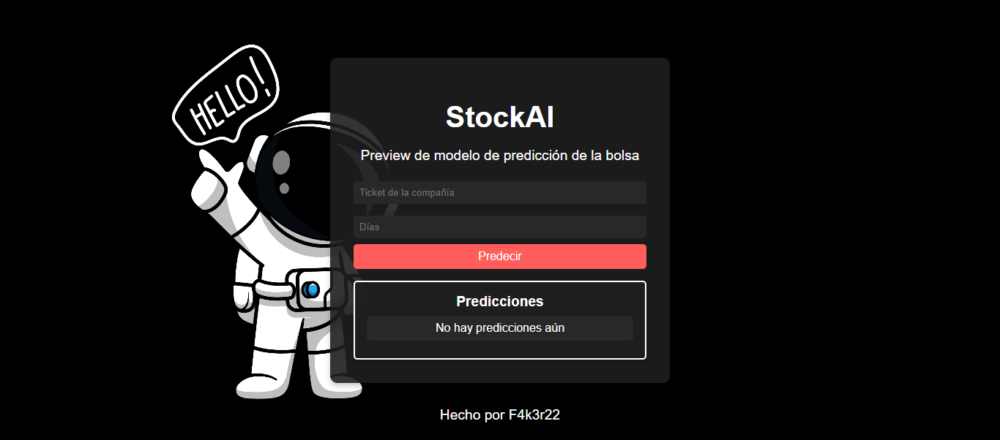
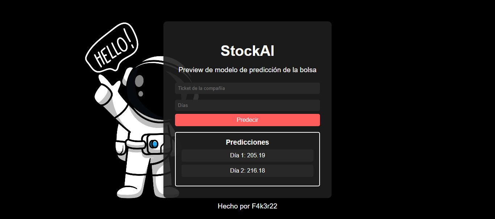

# 🤖StockAI💰
Este es un proyecto de ejemplo que incluye un modelo de predicción financiera utilizando datos de mercado. 💲

## 📌🤖StockAI-Flask💰
Implementación web para el modelo StockAI

---

### **✨ Repositorio Original del Modelo StockAI ✨**

  <a href="https://github.com/F4k3r22/StockAI">
    

---

## 🧠Descripción

Este una simple implementación de una interfaz web al modelo StockAI

## 📌Librerías Requeridas

Para ejecutar este proyecto, necesitarás tener instaladas las siguientes bibliotecas de Python:

- [yfinance](https://pypi.org/project/yfinance/): Utilizada para obtener datos financieros de Yahoo Finance.
- [numpy](https://numpy.org/): Biblioteca de Python para operaciones matemáticas.
- [pandas](https://pandas.pydata.org/): Biblioteca de Python para análisis de datos.
- [torch](https://pytorch.org/): Biblioteca de PyTorch para aprendizaje profundo.
- [scikit-learn](https://scikit-learn.org/stable/): Utilizada para la normalización de datos con el `MinMaxScaler`.
- [flask](https://flask.palletsprojects.com/en/3.0.x/): Biblioteca para hacer la interfaz web.

Puedes instalar estas bibliotecas utilizando pip:

pip install yfinance numpy pandas torch scikit-learn flask

## 📌Uso💰

Para utilizar este proyecto, sigue estos pasos:

1. Clona este repositorio en tu máquina local.
2. Instala las dependencias mencionadas anteriormente.
3. Ejecuta el script principal del proyecto.

Si tienes tarjeta gráfica NVIDIA te recomiendo instalar las dependencias necesarias de Pytorch para cargar el modelo con CUDA, y obtener
una mejora en el rendimiento y velocidad👨‍💻.

## 👾🤖 Capturas de la Demo en local

|   Captura 1📸   |   Captura 2📸   |
| :------------------------: | :--------------------------: |
|  |  |

## 🙇‍♂️Contribución

Si deseas contribuir a este proyecto, ¡eres bienvenido! Puedes abrir un problema para informar sobre errores o enviar una solicitud de extracción con tus mejoras propuestas. 🙇‍♂️

## 📌Licencia💰

Este proyecto está licenciado bajo los términos de RiveraAICloseLicense(2006) - ver el archivo [LICENSE](https://github.com/F4k3r22/StockAI?tab=License-1-ov-file) para más detalles. 📃📑

